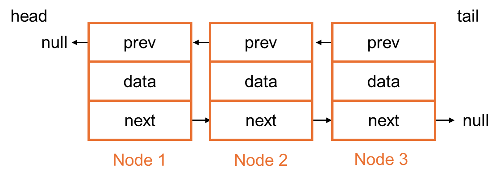
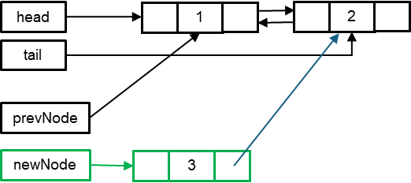
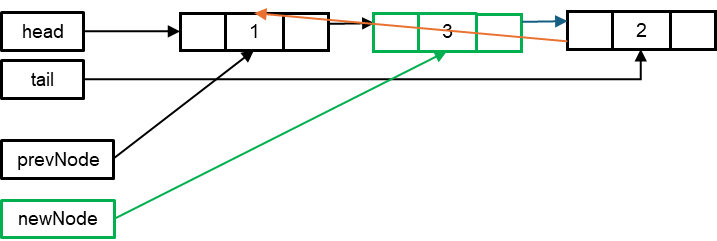
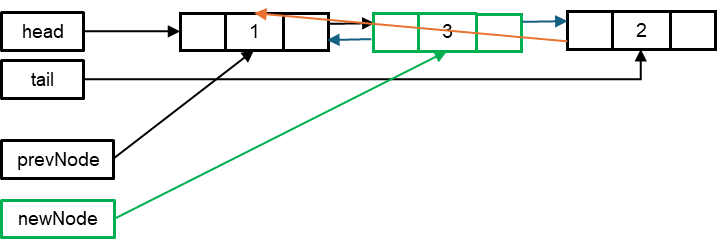
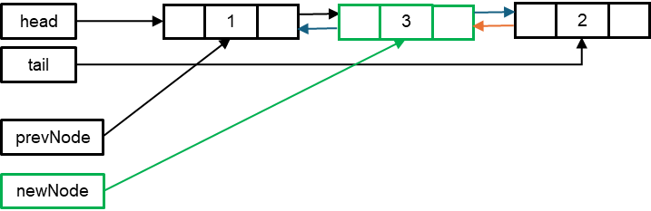

# Lista Doblemente Enlazada – Una Mirada a su Funcionamiento Interno

## Introducción

Suponga que está a cargo de diseñar un complejo sistema ferroviario. Pero no se trata de una línea de tren ordinaria; esta tiene un requisito particular. Los trenes deben ser capaces de avanzar a la siguiente estación y de retroceder a la anterior sin ningún contratiempo. Su única tarea es centrarse en cómo se mueven los trenes entre las estaciones, sin profundizar en los detalles técnicos.

¿Cómo diseñaría un sistema tan flexible? No se trata simplemente de una configuración de "sentido único". Se necesita un sistema que pueda gestionar el movimiento en ambas direcciones con la misma facilidad. La buena noticia es que la solución ya existe en una ingeniosa estructura de datos llamada **lista doblemente enlazada**.

En esta lectura, usted aprenderá sobre la estructura y la implementación de una lista doblemente enlazada en Java. También identificará y describirá sus componentes clave, incluidas la clase `Node` (Nodo) y la clase `DoublyLinkedList` (ListaDoblementeEnlazada). Esta comprensión fundamental lo preparará para conceptos más avanzados de estructuras de datos que se verán más adelante en el curso.

## ¿Por qué una lista doblemente enlazada?

Piense en cada tren de su sistema como un nodo en una lista. Cada **nodo** (o vagón de tren) no solo es consciente de hacia dónde se dirige, sino que también mantiene un registro de dónde ha estado. Es como tener un GPS que no solo lo guía a su destino, sino que también le ayuda a volver sobre sus pasos hasta el punto de partida si es necesario.

Esta **conexión bidireccional** es lo que proporciona una lista doblemente enlazada. Cada nodo en la lista tiene una referencia al nodo que le sigue (el puntero `next`, o la siguiente estación) y al nodo que le precede (el puntero `previous`, o la estación anterior). Esto facilita enormemente la navegación a través de los datos — o, utilizando la analogía del tren, a través de las estaciones — ya sea que se avance o se retroceda.

Profundicemos en cómo implementar esto en código y veamos cuán versátil puede ser una lista doblemente enlazada para construir su sistema de trenes.

## Componentes Fundamentales de la Lista: Los Nodos

En el núcleo de una lista doblemente enlazada se encuentran los nodos, que en nuestra analogía son los vagones individuales del tren. Cada nodo se compone de lo siguiente:
* **Dato (`data`)**: Corresponde a la información que almacena el nodo, como la carga o los pasajeros dentro de un vagón.
* **Siguiente (`next`)**: Una referencia (o puntero) al siguiente nodo en la secuencia, análogo al acoplamiento con el vagón de adelante.
* **Anterior (`previous`)**: Una referencia (o puntero) al nodo previo en la secuencia, análogo al acoplamiento con el vagón de atrás.

A continuación, se muestra cómo podría definirse una clase `Node` en Java:

```java
private static class Node {
    int data;
    Node next;
    Node prev;
    // Constructor to create a new node
    Node(int data) {
        this.data = data;
        this.next = null;
        this.prev = null;
    }
}
```

La variable de tipo entero `data` indica que el nodo almacena un número entero. La variable de referencia `next`, de tipo `Node`, apunta al siguiente nodo, mientras que `prev` apunta al nodo anterior.

El constructor parametrizado de la clase `Node` inicializa un nuevo nodo con el dato proporcionado y establece tanto `next` como `prev` a `null`, ya que el nuevo nodo aún no está enlazado a ningún otro en la lista doblemente enlazada.

## La Estructura de la Lista: Cabeza y Cola (`head` y `tail`)

Continuando con la analogía del tren, la cabeza (`head`) es el primer vagón y la cola (`tail`) es el último.

Cuando se crea la lista por primera vez, tanto la `head` como la `tail` apuntan a `null` porque el tren aún no ha sido ensamblado y no hay vagones en la vía.

<p align="center">
  
</p>

Después de añadir algunos vagones al tren, la lista se vería como se muestra en el siguiente diagrama:

<p align="center">
  
</p>

* Comenzando desde la **cabeza** (`head`), se puede avanzar a través de la lista siguiendo los punteros `next` (`next` -->).
* Comenzando desde la **cola** (`tail`), se puede retroceder a través de la lista siguiendo los punteros `prev` (<-- `prev`).

## Adición de un Nodo a la Lista

A continuación, exploremos cómo añadir vagones al tren. Se pueden añadir al **principio** del tren, al **final** o incluso en una posición **intermedia**.

### Añadir al Principio

Suponga que desea acoplar un nuevo vagón al frente del tren. Así es como se encuentra la lista inicialmente:

<p align="center">

</p>

* **Paso 1**: Crear un nuevo nodo con el dato deseado; en este caso, el valor 1.
  
  <p align="center">
  
  </p>

  
  
* **Paso 2**: Si la lista está vacía (`head == null`), tanto la `head` (cabeza) como la `tail` (cola) deben apuntar a este nuevo nodo, ya que será el único elemento. Por ejemplo, si la lista está inicialmente vacía, así es como head y tail referenciarán al nuevo nodo:

  <p align="center">
  
  </p>

* **Paso 3**: Suponga que la lista no está vacía. Por ejemplo, la lista ya contiene el nodo con el dato 1:
  
  <p align="center">
  
  </p>

Ahora, se intenta añadir otro nodo con el dato 2, por lo que se crea un nuevo nodo:

<p align="center">

</p>

Al añadir este nodo, se ejecutará el código del bloque else, ya que la lista no está vacía. Las siguientes imágenes ilustran el proceso de reasignación de punteros:
1. El puntero `next` del nuevo nodo (nodo 2) se asigna para que apunte a la `head` actual (nodo 1).
   
   <p align="center">
   
   </p>

2. El puntero `prev` de la `head` actual (nodo 1) se reasigna para que apunte al nuevo nodo (nodo 2).

   <p align="center">
   
   </p>

3. Finalmente, la head de la lista se actualiza para que apunte al nuevo nodo, convirtiéndolo en el nuevo inicio de la lista.

   <p align="center">
   
   </p>

La lista final quedará de la siguiente manera:

<p align="center">

</p>

El siguiente bloque de código representa este mismo proceso:

```java
public void addFront(int data) {
    Node newNode = new Node(data);		// creation of new node
    if (head == null) {		// if the list is empty
// the head and tail refer to the new node
        head = newNode;
        tail = newNode;
    } else {				// if the list is not empty
        // new node’s next refers to the head
        newNode.next = head;
        // current head’s prev refers to the new node
        head.prev = newNode;
        // new node becomes the head
        head = newNode;
    }
}
```
### Añadir al Final

¿Qué sucede si desea añadir un nuevo vagón al final del tren? Así es como se encuentra la lista inicialmente:

<p align="center">

</p>

* **Paso 1**: Se crea un nuevo nodo con el dato deseado; por ejemplo, el valor 1.
  
  <p align="center">
  
  </p>
  
* **Paso 2**: Si la lista está vacía (`head == null`), tanto la `head` (cabeza) como la `tail` (cola) deben apuntar a este nuevo nodo, ya que será el único elemento. Por ejemplo, si la lista está inicialmente vacía, así es como `head` y `tail` referenciarán al nuevo nodo:
  
  <p align="center">
  
  </p>
  
* **Paso 3**: Suponga que la lista no está vacía. Por ejemplo, la lista ya contiene un nodo con el dato 1, el cual es tanto la `head` como la `tail`.

  <p align="center">
  
  </p>

Ahora, se intenta añadir otro nodo con el dato 2, por lo que se crea un nuevo nodo:

<p align="center">

</p>

Al añadir este nodo, se ejecutará el código del bloque `else`, ya que la lista no está vacía. Las siguientes imágenes ilustran el proceso de reasignación de punteros:
1. El puntero `prev` del nuevo nodo (nodo 2) se asigna para que apunte a la `tail` actual (nodo 1).

   <p align="center">
   
   </p>

2. El puntero `next` de la `tail` actual (nodo 1) se reasigna para que apunte al nuevo nodo (nodo 2).

   <p align="center">
   
   </p>

3. Finalmente, la `tail` de la lista se actualiza para que apunte al nuevo nodo, convirtiéndolo en el nuevo final de la lista.

   <p align="center">
   
   </p>

La lista final quedará de la siguiente manera:

<p align="center">

</p>

El siguiente bloque de código representa este mismo proceso:

```java
public void addEnd(int data) {
    Node newNode = new Node(data);		// creation of new node
    if (tail == null) {		// if the list is empty
// the head and tail refer to the new node
        head = newNode;
        tail = newNode;
    } else {				// if the list is not empty
        // new node’s prev refers to the tail
        newNode.prev = tail;
        // current head’s next refers to the new node
        tail.next = newNode;
        // new node becomes the tail
        tail = newNode;
    }
}
```

### Insertar un Nodo en una Posición Intermedia

Supongamos que desea insertar un nuevo nodo entre dos nodos existentes. Para ello, debe especificar el nodo previo, después del cual se realizará la inserción. Por lo tanto, el método correspondiente debe incluir un parámetro para recibir dicho nodo.

Así es como se encuentra la lista inicialmente, con dos nodos existentes:

<p align="center">

</p>


* **Paso 1**: Si el nodo previo no existe, por ejemplo, un nodo con el valor de dato 4, entonces no se puede añadir el nodo en una posición intermedia; por lo tanto, simplemente se retorna.
* **Paso 2**: Si el nodo previo existe, como en la lista existente, y se desea añadir un nuevo nodo después del nodo con el valor de dato 1, se pasa el nodo con el valor de dato 1 como el nodo previo, y se creará una referencia al mismo:
  
  <p align="center">
  
  </p>

* **Paso 3**: Ahora, se crea un nuevo nodo con el dato, por ejemplo, 3:
  
  <p align="center">
  
  </p>

  1. El puntero `next` del nuevo nodo debe referenciar al `next` del nodo previo (el nodo con valor de dato 1), es decir, al nodo con valor de dato 2:

     <p align="center">
     
     </p>
  
  2. El puntero `next` del nodo previo (el nodo con valor de dato 1) ahora debe referenciar al nuevo nodo:

     <p align="center">
     
     </p>
  
  3. Además, el puntero `prev` del nuevo nodo debe referenciar al nodo previo (el nodo con valor de dato 1):

     <p align="center">
     
     </p>
  
* **Paso 4**: Observe que el puntero `prev` del nodo con valor de dato 2 todavía referencia al nodo con valor de dato 1, mientras que debe referenciar al nuevo nodo. Corrijamos eso:
  
  Se debe verificar si el nuevo nodo es el último en la lista.
  * **Si no lo es**, se debe hacer que el puntero `prev` del siguiente nodo referencie al nuevo nodo.
    * Por ejemplo, el nuevo nodo no es el último en la lista. Por lo tanto, se determina el siguiente del nuevo nodo como `newNode.next` y luego se hace que su puntero `prev` referencie al nuevo nodo (la operación sería `newNode.next.prev = newNode`).
    
    <p align="center">
    
    </p>

  * **De lo contrario** (si el nodo previo era la `tail`), se hace que la `tail` referencie al nuevo nodo.

  A continuación se presenta la lista final después de que el nuevo nodo ha sido insertado:

  <p align="center">
  
  </p>

El siguiente bloque de código representa el proceso completo:

```java
public void addAfter(Node prevNode, int data) {
    if (prevNode == null) {	// check if the previous node is null
        return;			// if it is, then return
    }
    Node newNode = new Node(data);	// create a new node
    newNode.next = prevNode.next;	// set the next of new node to next of prev node
    prevNode.next = newNode;	// set the next of prev node to new node
    newNode.prev = prevNode;	// set the previous of new node to prev node
    if (newNode.next != null) {	// check if the new node is not the last node
        newNode.next.prev = newNode;	// set the next node's prev to the new node
    } else {				// if the new node is the last node
        tail = newNode;		// set the tail to the new node
    }
}
```

## Recorrido de la Lista

Algunas veces se necesita empezar en la locomotora y moverse hacia el furgón de cola, y otras veces, se empieza en el furgón de cola y se avanza de regreso hacia la locomotora.


Para lograr esto, se necesita una forma de recorrer el tren desde el frente hacia atrás y desde atrás hacia el frente. Veamos cómo se puede hacer esto con una lista doblemente enlazada, la cual permite moverse en ambas direcciones, tal como un tren. 

## Recorrido hacia Adelante (desde `head` hasta `tail`)

Cuando se empieza en la locomotora (`head` de la lista) y se avanza hacia el furgón de cola (`tail` de la lista), se está realizando un **recorrido hacia adelante**. Esto es como caminar desde el frente del tren hacia la parte trasera, revisando cada vagón en el camino.

```java
public void traverseForward() {
    Node current = head;
    while (current != null) {
        System.out.print(current.data + " ");
        current = current.next;
    }
    System.out.println();
}
```

En este código, se comienza en la `head` de la lista, la cual es el primer nodo (o la locomotora de nuestro tren). Luego, se avanza a través de cada nodo, imprimiendo el dato almacenado en él (similar a revisar los elementos en cada vagón).El bucle continúa hasta que se alcanza el valor `null`, lo que significa que se ha llegado al final de la lista (el furgón de cola). Después de imprimir el dato del último nodo, el recorrido finaliza.

## Recorrido hacia Atrás (desde `tail` hasta `head`)

A veces, podría ser necesario comenzar la inspección en el furgón de cola (`tail` de la lista) y avanzar de regreso hacia la locomotora. Esto es un recorrido hacia atrás.


```java
public void traverseBackward() {
    Node current = tail;
    while (current != null) {
        System.out.print(current.data + " ");
        current = current.prev;
    }
    System.out.println();
}
```

En este caso, se comienza en la `tail` de la lista, la cual es el último nodo (el furgón de cola de nuestro tren). Se retrocede a través de la lista siguiendo los punteros `prev`, los cuales apuntan al nodo anterior (el vagón que está antes del actual). Se imprime el dato de cada nodo a medida que se avanza, hasta que se alcanza el valor null en la head de la lista. Este recorrido permite inspeccionar el tren desde la parte trasera hacia el frente.
 
## Eliminación de un Nodo

Así como se añade un nuevo vagón a la línea del tren, a veces se necesita eliminar uno. Cada nodo conoce a sus vecinos en ambas direcciones, simplificando el proceso de eliminación. Aunque hay más referencias que actualizar (`prev` y `next`), no se necesita recorrer la lista para encontrar el nodo previo, como se haría en una lista simplemente enlazada. Este acceso directo hace que la eliminación de nodos sea más directa.

Desglosemos el proceso de eliminación de un nodo:

### Eliminación del Nodo `head` (Cabeza)

Al eliminar la `head` (el primer vagón del tren), se necesita hacer lo siguiente:
* **Actualizar la `head`**: La `head` de la lista ahora debe ser el siguiente nodo.
* **Actualizar la referencia previous de la nueva `head`**: La referencia `previous` (anterior) de la nueva head debe establecerse en `null`.

A continuación se muestra cómo se podría implementar esto en Java:

```java
public void removeFront() {
    if (head == null) {		// check if the head is null
        return; // if it is, return because there is nothing to remove. The list is already empty
    }
    head = head.next;	// set the head to the next node
    if (head != null) {		// check if the head is not null
        head.prev = null;	// set the previous of the head to null
    } else {
        // If the head is null, there were no other nodes on the list except for the one you removed.
        // The list is now empty, so you must also set the tail to null.
        tail = null;  
    }
}
```

En este código, si la lista tiene solo un nodo, establecer la `head` en `null` también requiere establecer la `tail` en `null`, ya que la lista queda vacía.

### Eliminación del Nodo `tail` (Cola)

Eliminar la tail (el último vagón del tren) involucra pasos similares:
* **Actualizar la `tail`**: La `tail` de la lista ahora debe ser el nodo previo.
* **Actualizar la referencia next de la nueva `tail`**: La referencia `next` (siguiente) de la nueva `tail` debe establecerse en `null`.

A continuación se presenta el código Java para ello:

```java
public void removeEnd() {
    if (tail == null) {
        return; // List is already empty
    }
    tail = tail.prev;
    if (tail != null) {
        tail.next = null;
    } else {
        // If the tail is now null, it means the list had only one node, which has been removed.
        // Set head to null to indicate that the list is completely empty.
        head = null;
    }
}
```

### Eliminación de un Nodo Intermedio

Eliminar un nodo de una posición intermedia en una lista doblemente enlazada es más fácil que en una lista simplemente enlazada. Dado que cada nodo tiene referencias tanto a su nodo `next` (siguiente) como `prev` (previo), se pueden actualizar directamente estas referencias para desvincular el nodo de la lista. 

En una lista simplemente enlazada, solo se tiene una referencia al siguiente nodo, por lo que se debe recorrer la lista para encontrar el nodo anterior al que se desea eliminar. Este paso adicional hace que la eliminación sea menos eficiente, especialmente en listas grandes.

El proceso es el siguiente:
* **Actualizar el nodo previo**: El puntero `next` del nodo anterior al que se elimina debe actualizarse para que apunte al nodo posterior al que se elimina.
* **Actualizar el nodo siguiente**: El puntero `prev` del nodo posterior al que se elimina debe actualizarse para que apunte al nodo anterior al que se elimina.

Así es como se ve esto en código:

```java
public void removeNode(Node node) {
    if (node == null) {
        return;
    }
    if (node == head) {
        removeFront();
        return;
    }
    if (node == tail) {
        removeEnd();
        return;
    }
    // Update the previous node's next pointer
    node.prev.next = node.next;
    // Update the next node's previous pointer
    node.next.prev = node.prev;
}
```

## Ventajas de una lista doblemente enlazada sobre una lista simplemente enlazada

|Acción | Lista doblemente enlazada versus lista simplemente enlazada|
|---|---|
|Añadir (`add`) | En términos de añadir nodos, como se observó anteriormente, en una lista doblemente enlazada, usted puede añadir nodos antes o después de un nodo específico sin recorrido, a diferencia de una lista simplemente enlazada, la cual requiere encontrar el nodo previo.|
|Eliminar (`revome`) | Una lista doblemente enlazada permite la eliminación directa de nodos sin recorrido, mientras que una lista simplemente enlazada requiere encontrar el nodo previo.|
|Actualizar (`update`) | La reorganización de nodos es más accesible en una lista doblemente enlazada debido al acceso a los punteros next y prev, mientras que una lista simplemente enlazada requiere un recorrido adicional.|
|Recorrer (`traverse`) | Una lista doblemente enlazada soporta el recorrido bidireccional, a diferencia de una lista simplemente enlazada, la cual solo permite el recorrido hacia adelante.|

La elección entre estas depende de los requisitos y prioridades, ya que ambas tienen ventajas una sobre la otra en algunos contextos. Elija una lista simplemente enlazada para una mejor eficiencia de memoria, pero opte por una lista doblemente enlazada si la velocidad y la eficiencia operativa son más importantes.

## Conclusión

En Java, una lista doblemente enlazada funciona tal como la línea de tren en este ejemplo, haciendo fácil el moverse tanto hacia adelante como hacia atrás a través de una secuencia de datos. Esta estructura es especialmente útil en escenarios donde se necesita navegar hacia adelante y hacia atrás, como al deshacer acciones en un editor de texto o navegar a través de páginas web en un navegador.

Al comprender cómo se construye una lista doblemente enlazada y cómo funciona, usted está ahora mejor equipado para gestionar sus propios "trenes de datos", ya sea en código o en concepto. La próxima vez que se encuentre necesitando recorrer datos en ambas direcciones, piense en la línea de tren y en la lista doblemente enlazada que la impulsa.